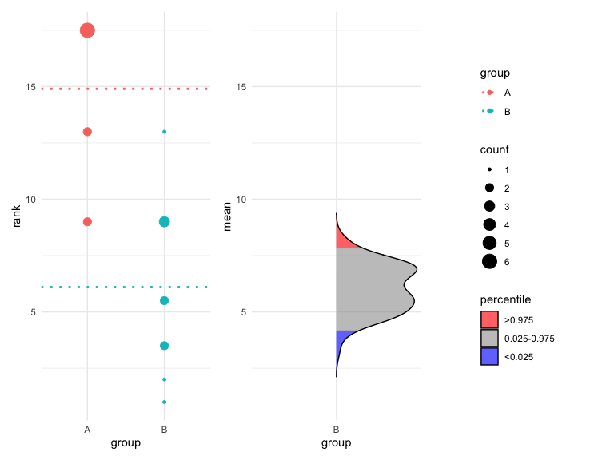
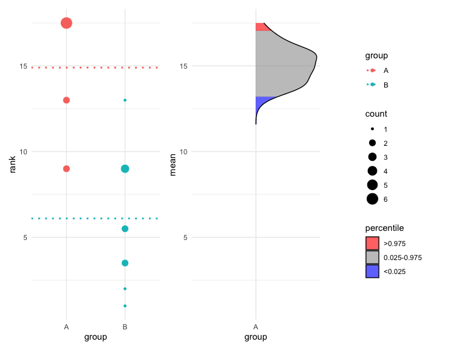
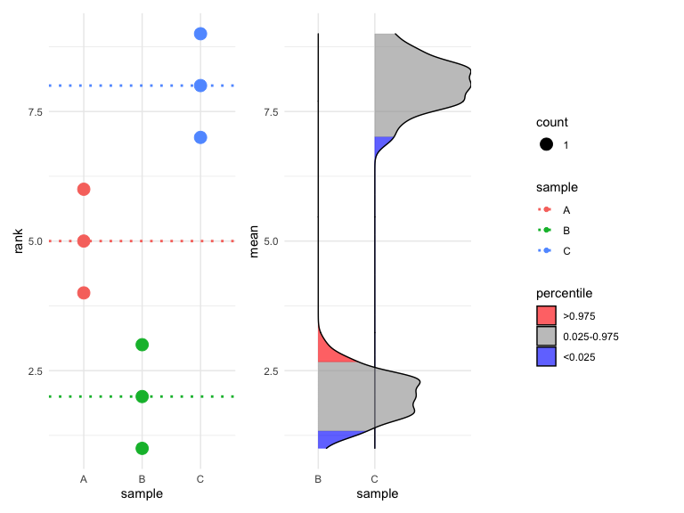
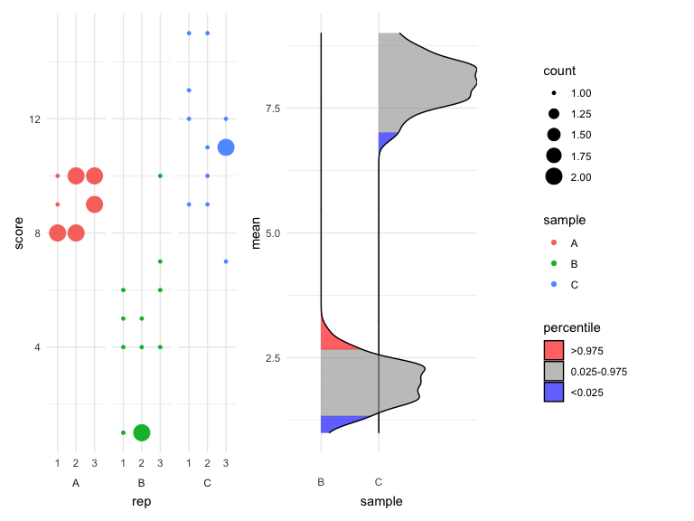
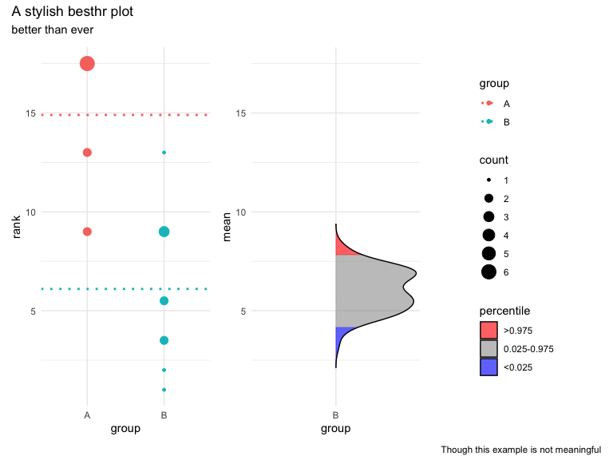
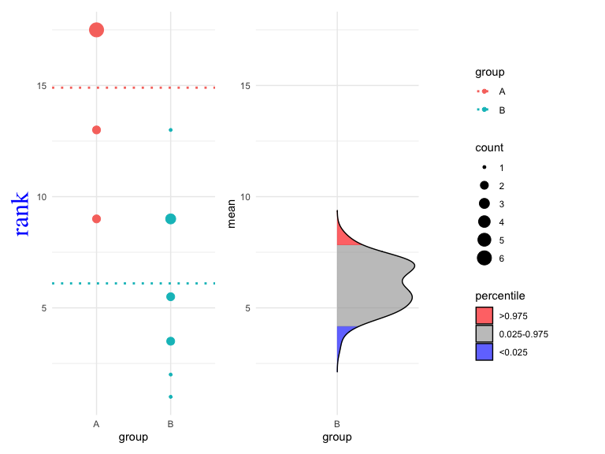
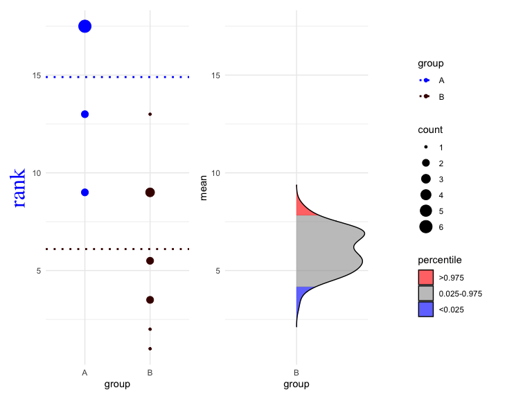
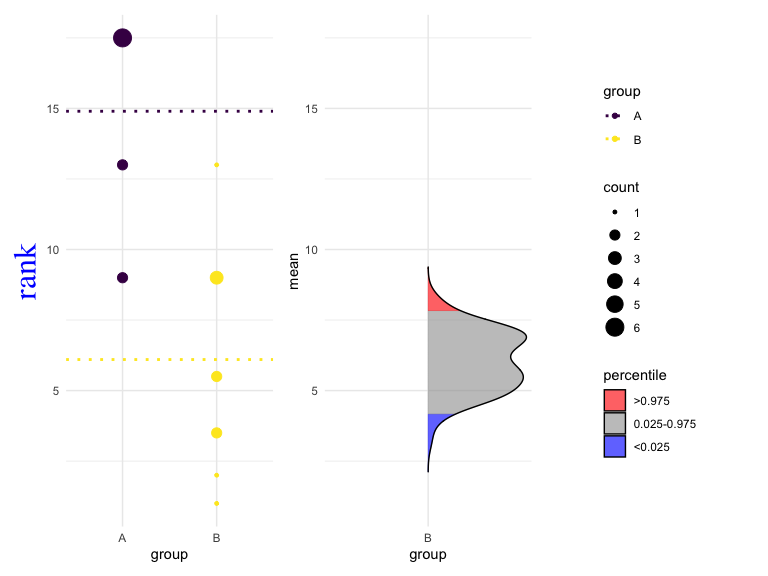
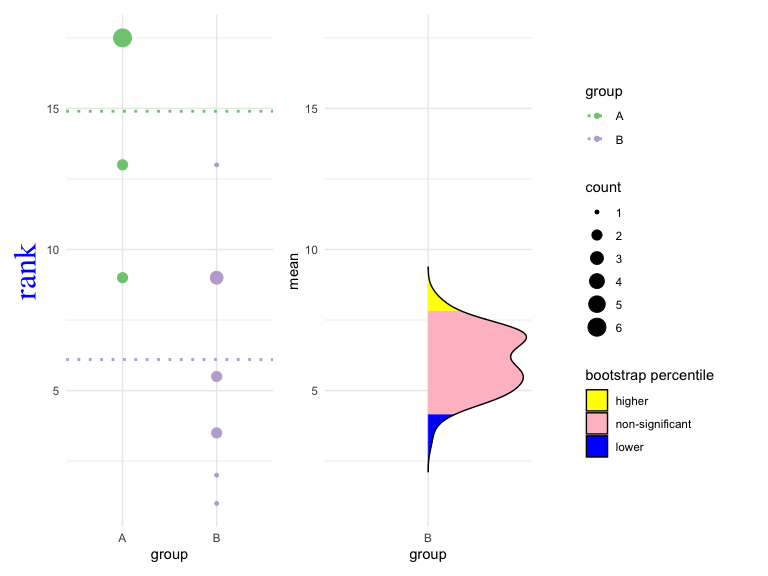

besthr - Generating Bootstrap Estimation Distributions of HR Data
================
Dan MacLean
06 October, 2022

<!-- badges: start -->
[](https://doi.org/10.5281/zenodo.3374507)
[](https://github.com/TeamMacLean/besthr/actions)
<!-- badges: end -->

## Synopsis

besthr is a package that creates plots showing scored HR experiments and
plots of distribution of means of ranks of HR score from bootstrapping.

## Installation

You can install from CRAN in the usual way.

``` r
install.packages("besthr")

# or for the dev version
#install.packages("devtools")
devtools::install_github("TeamMacLean/besthr")
```

## Citation

Please cite as

> Dan MacLean. (2019). TeamMacLean/besthr: Initial Release (0.3.0).
> Zenodo. <https://doi.org/10.5281/zenodo.3374507>

## Simplest Use Case - Two Groups, No Replicates

With a data frame or similar object, use the `estimate()` function to
get the bootstrap estimates of the ranked data.

`estimate()` has a basic function call as follows:

`estimate(data, score_column_name, group_column_name, control = control_group_name)`

The first argument after the

``` r
library(besthr)

hr_data_1_file <- system.file("extdata", "example-data-1.csv", package = "besthr")
hr_data_1 <- readr::read_csv(hr_data_1_file)
```

    ## Rows: 20 Columns: 2
    ## ── Column specification ────────────────────────────────────────────────────────
    ## Delimiter: ","
    ## chr (1): group
    ## dbl (1): score
    ## 
    ## ℹ Use `spec()` to retrieve the full column specification for this data.
    ## ℹ Specify the column types or set `show_col_types = FALSE` to quiet this message.

``` r
head(hr_data_1)
```

    ## # A tibble: 6 × 2
    ##   score group
    ##   <dbl> <chr>
    ## 1    10 A    
    ## 2     9 A    
    ## 3    10 A    
    ## 4    10 A    
    ## 5     8 A    
    ## 6     8 A

``` r
hr_est_1 <- estimate(hr_data_1, score, group, control = "A")
hr_est_1
```

    ## besthr (HR Rank Score Analysis with Bootstrap Estimation)
    ## =========================================================
    ## 
    ## Control: A
    ## 
    ## Unpaired mean rank difference of A (14.9, n=10) minus B (6.1, n=10)
    ##  8.8
    ## Confidence Intervals (0.025, 0.975)
    ##  4.16625, 7.82625
    ## 
    ## 100 bootstrap resamples.

``` r
plot(hr_est_1)
```

    ## Picking joint bandwidth of 0.376

<!-- -->

### Setting Options

You may select the group to set as the common reference control with
`control`.

``` r
estimate(hr_data_1, score, group, control = "B" ) %>%
  plot()
```

    ## Picking joint bandwidth of 0.383

<!-- -->

You may select the number of iterations of the bootstrap to perform with
`nits` and the quantiles for the confidence interval with `low` and
`high`.

``` r
estimate(hr_data_1, score, group, control = "A", nits = 1000, low = 0.4, high = 0.6) %>%
  plot()
```

    ## Picking joint bandwidth of 0.261

<!-- -->

## Extended Use Case - Technical Replicates

You can extend the `estimate()` options to specify a third column in the
data that contains technical replicate information, add the technical
replicate column name after the sample column. Technical replicates are
automatically merged using the `mean()` function before ranking.

``` r
hr_data_3_file <- system.file("extdata", "example-data-3.csv", package = "besthr")
hr_data_3 <- readr::read_csv(hr_data_3_file)
```

    ## Rows: 36 Columns: 3
    ## ── Column specification ────────────────────────────────────────────────────────
    ## Delimiter: ","
    ## chr (1): sample
    ## dbl (2): score, rep
    ## 
    ## ℹ Use `spec()` to retrieve the full column specification for this data.
    ## ℹ Specify the column types or set `show_col_types = FALSE` to quiet this message.

``` r
head(hr_data_3)
```

    ## # A tibble: 6 × 3
    ##   score sample   rep
    ##   <dbl> <chr>  <dbl>
    ## 1     8 A          1
    ## 2     9 A          1
    ## 3     8 A          1
    ## 4    10 A          1
    ## 5     8 A          2
    ## 6     8 A          2

``` r
hr_est_3 <- estimate(hr_data_3, score, sample, rep, control = "A")

hr_est_3
```

    ## besthr (HR Rank Score Analysis with Bootstrap Estimation)
    ## =========================================================
    ## 
    ## Control: A
    ## 
    ## Unpaired mean rank difference of A (5, n=3) minus B (2, n=3)
    ##  3
    ## Confidence Intervals (0.025, 0.975)
    ##  1.33333333333333, 2.66666666666667
    ## 
    ## Unpaired mean rank difference of A (5, n=3) minus C (8, n=3)
    ##  -3
    ## Confidence Intervals (0.025, 0.975)
    ##  7, 9
    ## 
    ## 100 bootstrap resamples.

``` r
plot(hr_est_3)
```

    ## Picking joint bandwidth of 0.163

<!-- -->

### Alternate Plot Options

In the case where you have use technical replicates and want to see
those plotted you can use an extra plot option `which`. Set `which` to
`just_data` if you wish the left panel of the plot to show all data
without ranking. This will only work if you have technical replicates.

``` r
hr_est_3 %>% 
  plot(which = "just_data")
```

    ## Picking joint bandwidth of 0.163

<!-- -->

## Styling Plots

You can style plots to your own taste. The object returned from `plot()`
is a `patchwork` <https://patchwork.data-imaginist.com/> object that
composes two separate plots, the dot plot and the bootstrap percentile
plot, which are themselves `ggplot` objects. So you can use a mixture of
`patchwork` annotations functions for whole plot labels and `ggplot`
themes for individual elements.

### Adding annotations.

You can use the `patchwork` `plot_annotation()` function to add titles

``` r
library(patchwork)

p <- plot(hr_est_1)

p + plot_annotation(title = 'A stylish besthr plot', 
                    subtitle = "better than ever", 
                    caption = 'Though this example is not meaningful')
```

    ## Picking joint bandwidth of 0.376

<!-- -->

``` r
p
```

    ## Picking joint bandwidth of 0.376

<!-- -->

### Targetting a subplot to make theme changes

You can change the style of the individual plot elements using
subsetting syntax `[[]]` . The dot plot can be addressed within the
`patchwork` object using index 1 within the `patchwork` object `p[[1]]`,
and the percentile plot using `p[[2]]`. You must add to the existing
subplot then assign the result back to see the difference in the plot.
Here’s an example that uses `theme()` to restyle the y-axis text of the
dot plot

``` r
library(ggplot2)
p[[1]] <- p[[1]] + theme(axis.title.y = element_text(family = "Times", colour="blue", size=24))
p
```

    ## Picking joint bandwidth of 0.376

<!-- -->

### Changing the scale colours of a subplot

You can change the colours used by the scales in the same way using the
`scale` functions, though as the type of scale is different for the dot
plot and bootstrap plot you will need to apply a different scale for
each.

For the dot plot, use a discrete scale e.g `scale_colour_manual()`,
`scale_colour_viridis_d()` or `scale_colour_brewer(type = "qual")`

``` r
p[[1]] <- p[[1]] + scale_colour_manual(values = c("blue", "#440000"))
p
```

    ## Picking joint bandwidth of 0.376

<!-- -->

``` r
p[[1]] <- p[[1]] + scale_colour_viridis_d()
```

    ## Scale for 'colour' is already present. Adding another scale for 'colour',
    ## which will replace the existing scale.

``` r
p
```

    ## Picking joint bandwidth of 0.376

<!-- -->

``` r
p[[1]] <- p[[1]] + scale_colour_brewer(type="qual", palette="Accent")
```

    ## Scale for 'colour' is already present. Adding another scale for 'colour',
    ## which will replace the existing scale.

``` r
p
```

    ## Picking joint bandwidth of 0.376

<!-- -->

For the percentile plot, use only `scale_colour_manual()` with specified
colours. Annoyingly, this rewrites the other values associated with the
scale each time, so you’ll need to replace those.

``` r
p[[2]] <- p[[2]] + scale_fill_manual(
  values = c("blue", "pink", "yellow"),
  name = "bootstrap percentile", labels=c("lower", "non-significant", "higher"),
  guide = guide_legend(reverse=TRUE)
  )
```

    ## Scale for 'fill' is already present. Adding another scale for 'fill', which
    ## will replace the existing scale.

``` r
p
```

    ## Picking joint bandwidth of 0.376

<!-- -->
